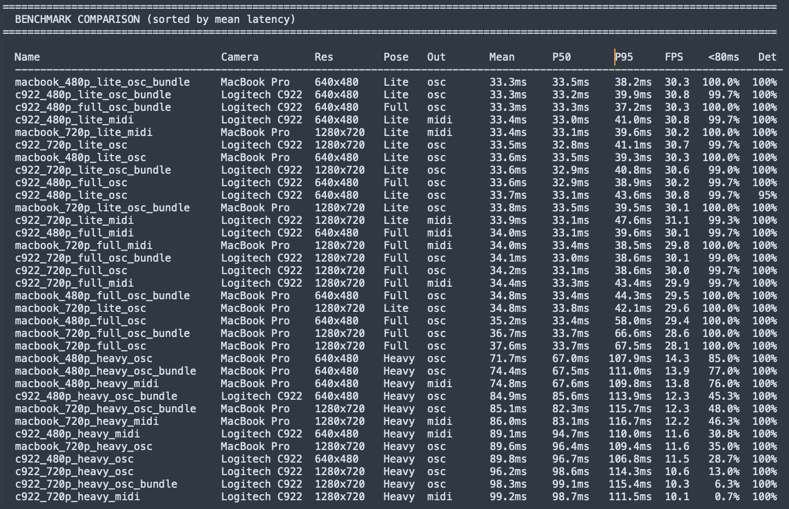
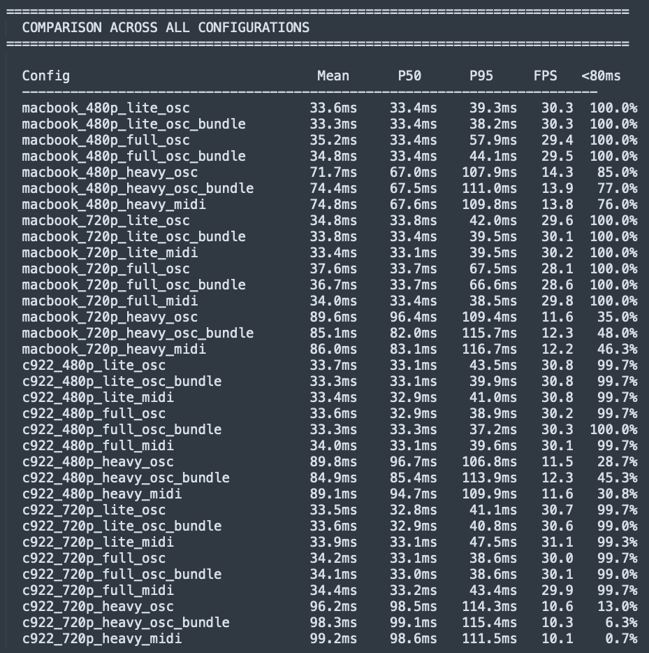
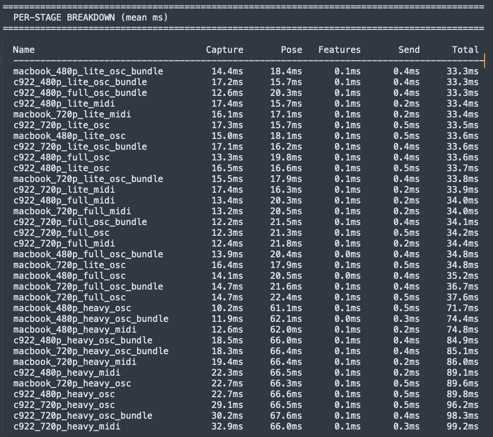
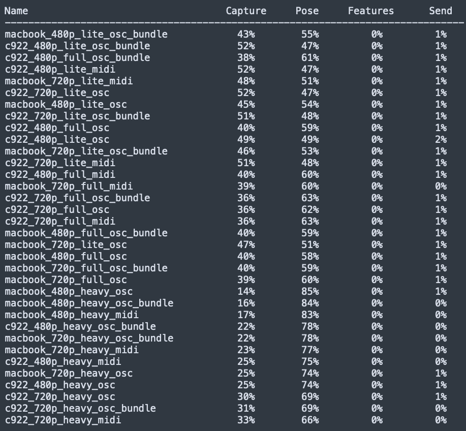
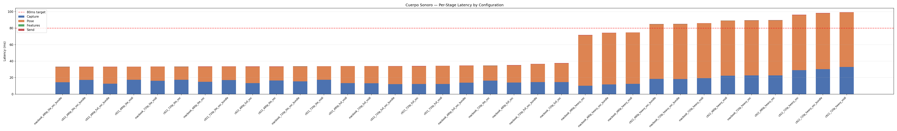
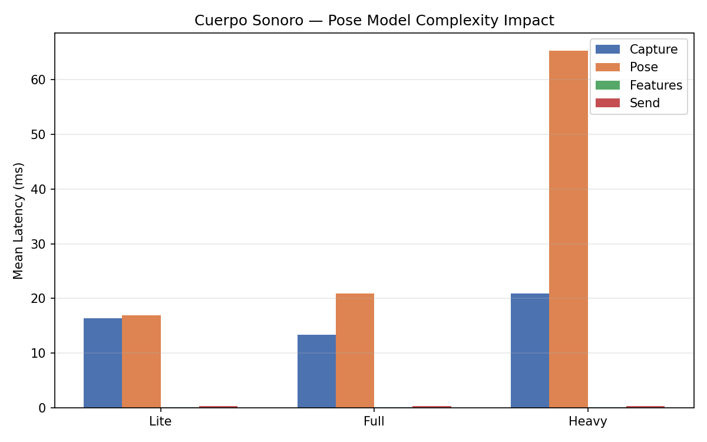
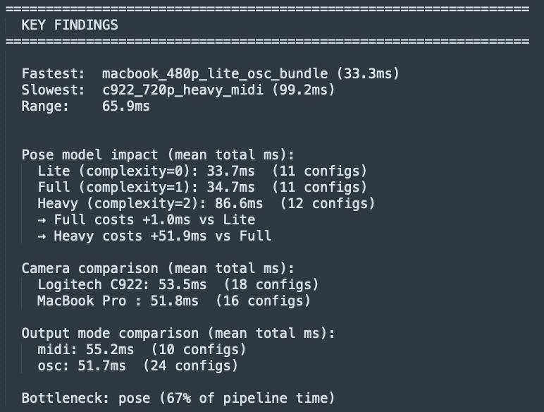
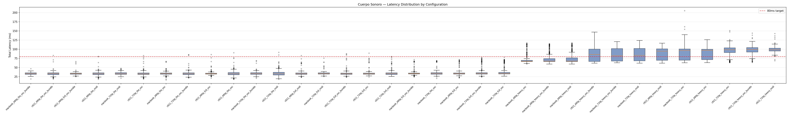

# Latency Benchmarks

Systematic evaluation of the Cuerpo Sonoro pipeline latency across different hardware and software configurations. This data directly supports the **Testing and Evaluation** chapter of the TFG.

---

## Table of Contents

- [Methodology](#methodology)
- [Test Environments](#test-environments)
- [Configuration Matrix](#configuration-matrix)
- [Results](#results)
  - [Mac — Overview](#mac--overview)
  - [Mac — Per-Stage Breakdown](#mac--per-stage-breakdown)
  - [Mac — Pose Model Impact](#mac--pose-model-impact)
  - [Mac — Key Findings](#mac--key-findings)
  - [Jetson Orin Nano — MediaPipe CPU](#jetson-orin-nano--mediapipe-cpu)
  - [Jetson Orin Nano — YOLOv8-Pose + TensorRT](#jetson-orin-nano--yolov8-pose--tensorrt)
- [Latency Distribution](#latency-distribution)
- [Conclusions](#conclusions)
- [Reproducing the Benchmarks](#reproducing-the-benchmarks)

---

## Methodology

The benchmarking system instruments the four stages of the real-time pipeline using `time.perf_counter()`:

```
Camera Capture → Pose Estimation → Feature Extraction → OSC/MIDI Send
    (capture)       (pose)            (features)          (send)
```

Each benchmark run:

1. Opens the camera and initializes all pipeline components for the given configuration.
2. Discards 30 warmup frames to let the pose estimator stabilize.
3. Measures the target number of frames, recording per-stage timestamps for each frame.
4. Runs **headless** (no OpenCV display window) to avoid contaminating measurements with rendering overhead.
5. Outputs raw per-frame data and aggregate statistics (mean, P50, P95, P99, max) as CSV files.

**What is measured:** Software-level latency from frame capture to OSC/MIDI send. This does not include the audio engine processing time (SuperCollider buffer, typically 3-6ms on CoreAudio, 1.5ms on JACK).

**What is not measured:** The final audio output latency (DAC buffer).

---

## Test Environments

### Environment A — Mac (development machine)

| Component | Specification |
|-----------|--------------|
| Machine | MacBook Pro 2020 (Intel i7 Quad-Core 2.3 GHz, 32 GB RAM) |
| OS | macOS (Darwin x86_64) |
| Camera 1 | MacBook Pro Built-in (720p native) |
| Camera 2 | Logitech C922 (1080p native, USB) |
| Python | 3.11 |
| Backend | MediaPipe Full — CPU (XNNPACK delegate) |
| Frames per config | 300 (+ 30 warmup) |

### Environment B — Mac Apple Silicon (production candidate)

| Component | Specification |
|-----------|--------------|
| Machine | MacBook Pro M4 |
| OS | macOS (Darwin arm64) |
| Backend | MediaPipe Full — Metal GPU delegate |
| Status | Verified working. Benchmark pending. |

### Environment C — NVIDIA Jetson Orin Nano (installation hardware)

| Component | Specification |
|-----------|--------------|
| Machine | NVIDIA Jetson Orin Nano 8GB (JetPack 6.1, CUDA 12.6, TensorRT 10.3) |
| OS | Ubuntu 22.04 aarch64 |
| Camera | Logitech C922 (USB) |
| Python | 3.10 |
| Backend A | MediaPipe Full — CPU (XNNPACK delegate) |
| Backend B | YOLOv8-Pose — TensorRT GPU (pending) |
| Frames | 60 (+ 10 warmup) |

---

## Configuration Matrix

### Mac matrix (36 configurations)

```
2 cameras × 2 resolutions × 3 pose models × 3 output modes = 36
```

| Dimension | Values |
|-----------|--------|
| Camera | MacBook Pro Built-in (device 1), Logitech C922 (device 0) |
| Resolution | 480p (640×480), 720p (1280×720) |
| Pose model | Lite (complexity=0), Full (complexity=1), Heavy (complexity=2) |
| Output mode | OSC individual, OSC bundle, MIDI/MPE |

### Jetson matrix

| Configuration | Backend | `jetson_clocks` | Frames |
|---------------|---------|-----------------|--------|
| Baseline CPU | MediaPipe Full | Off | 60 |
| CPU with clocks | MediaPipe Full | On | 60 |
| GPU TensorRT | YOLOv8-Pose | On | pending |

---

## Results

### Mac — Overview

All 36 configurations sorted by mean total latency. Lite and Full models comfortably meet the 80ms target across all cameras and output modes. Heavy consistently exceeds it.



The fastest configuration is `macbook_480p_lite_osc_bundle` at **33.3ms** mean latency. The slowest is `c922_720p_heavy_midi` at **99.2ms**.



### Mac — Per-Stage Breakdown







### Mac — Pose Model Impact



| Pose Model | Mean Latency | Pose Stage | FPS | Under 80ms |
|------------|-------------|-----------|-----|-----------|
| **Lite** (complexity=0) | 33.7ms | ~17ms | ~30 | 99–100% |
| **Full** (complexity=1) | 34.7ms | ~21ms | ~30 | 99–100% |
| **Heavy** (complexity=2) | 86.6ms | ~65ms | ~12 | 6–85% |

Critical observations:

- **Full costs only +1.0ms vs Lite.** Full provides better pose accuracy at virtually no latency cost — it is the clear recommendation for production use.
- **Heavy costs +51.9ms vs Full.** Heavy is not viable for real-time interaction on this hardware.

### Mac — Key Findings



| Variable | Finding | Impact |
|----------|---------|--------|
| **Pose model** | Bottleneck. Full ≈ Lite, Heavy 2.5× slower | **Critical** |
| **Camera** | C922 1.7ms slower than Built-in | **Negligible** |
| **Resolution** | 480p vs 720p: ~1-3ms difference | **Negligible** |
| **Output mode** | OSC vs MIDI: ~3.5ms difference | **Negligible** |
| **OSC send mode** | Individual vs bundle: <1ms | **Negligible** |
| **Pipeline bottleneck** | Pose estimation: 67% of total time | Features + Send: <1ms |

---

### Jetson Orin Nano — MediaPipe CPU

Measured with Logitech C922 at 1280×720, model_complexity=1 (Full), 60 frames.

#### Without `jetson_clocks` (default power mode)

| Metric | Value |
|--------|-------|
| Mean | 89.0ms |
| P50 | 92.9ms |
| P95 | 98.9ms |
| Max | 99.4ms |

**Result: outside the 80ms budget.** The Jetson throttles CPU frequency by default to manage thermals.

#### With `jetson_clocks` (clocks fixed at maximum)

```bash
sudo jetson_clocks
```

| Metric | Value |
|--------|-------|
| Mean | **55.9ms** |
| P50 | 55.8ms |
| P95 | 56.8ms |
| Max | 57.1ms |

**Result: inside the 80ms budget with ~24ms margin.** Variance is minimal (±1ms), suitable for exhibition.

Note: this configuration was characterized and documented but not adopted as the production backend for the Jetson. See below.

#### Why CPU was not chosen for Jetson production

MediaPipe CPU at 55.9ms is technically viable, but it uses only the CPU, leaving the Ampere GPU idle. The Jetson was chosen specifically for GPU inference. Additionally, CPU-only MediaPipe provides no multi-person capability — a meaningful limitation for a public installation where multiple visitors may interact simultaneously.

---

### Jetson Orin Nano — YOLOv8-Pose + TensorRT

**Status: pending.** The YOLOv8 backend (`vision_processor/backends/yolov8.py`) is implemented but not yet benchmarked on the Jetson. Results will be added here once measured.

Expected: <20ms pose stage, ~30 FPS, multi-person detection.

---

## Latency Distribution (Mac)



Lite and Full configurations cluster tightly around 33-35ms. Heavy shows higher medians (70-100ms) and wider variance, with P95 values reaching 110-115ms.

---

## Conclusions

### Mac

1. **The 80ms target is met** by all Lite and Full configurations (99-100% of frames).
2. **MediaPipe Full (complexity=1) is the recommended model** on Mac. It costs only +1ms over Lite with meaningfully better accuracy.
3. **Heavy is not viable** for real-time interaction on this hardware.
4. **Camera, resolution, and output protocol are negligible** variables. Choose based on image quality and physical constraints, not latency.
5. **Pose estimation is the bottleneck** (67% of pipeline time). GPU acceleration is the primary optimization lever.

### Jetson

6. **`jetson_clocks` is mandatory** for sub-80ms performance. Without it, MediaPipe CPU exceeds the budget at 89ms mean.
7. **The production backend for Jetson is YOLOv8-Pose + TensorRT**, chosen for GPU utilization and multi-person detection over the CPU-only MediaPipe path.
8. **GPU acceleration via MediaPipe on Jetson is not viable** without compiling from source. The pip wheel for aarch64/JetPack 6 runs on CPU only, and MediaPipe's TFLite models cannot be converted to TensorRT due to the unsupported `DENSIFY` operator.

---

## Reproducing the Benchmarks

### Running Benchmarks

```bash
# List all combinations without running
python benchmarks/run_benchmark.py --list

# Run full Mac matrix with camera preview
python benchmarks/run_benchmark.py --preview --session-name full-matrix

# Run a filtered subset
python benchmarks/run_benchmark.py --camera-profile c922 --pose full --output osc

# Custom frame count
python benchmarks/run_benchmark.py --frames 500 --warmup 50
```

**Flags:**

| Flag | Description |
|------|-------------|
| `--list` | Print all combinations and exit |
| `--preview` | Show camera feed with skeleton before each run |
| `--camera-profile` | Filter by camera (`c922`, `macbook`) |
| `--pose` | Filter by pose model (`lite`, `full`, `heavy`) |
| `--output` | Filter by output mode (`osc`, `midi`) |
| `--frames N` | Frames to measure per config (default: 300) |
| `--warmup N` | Warmup frames to discard (default: 30) |
| `--session-name` | Custom name for the results folder |

### Analyzing Results

```bash
pip install pandas matplotlib

python benchmarks/analyze_results.py --save
python benchmarks/analyze_results.py --session 2026-02-17_full-matrix
python benchmarks/analyze_results.py --filter c922
python benchmarks/analyze_results.py --list-sessions
```

### Directory Structure

```
benchmarks/
├── README.md                  ← This file
├── run_benchmark.py           ← Benchmark runner
├── analyze_results.py         ← Analysis with pandas + matplotlib
├── results/                   ← Session folders with raw data (gitignored)
│   └── 2026-02-17_full-matrix/
│       ├── latency_raw_20260217_*.csv
│       └── latency_summary_20260217_*.csv
└── charts/                    ← Generated charts and screenshots (gitignored)
    ├── chart_stages.png
    ├── chart_boxplot.png
    ├── chart_pose_comparison.png
    ├── benchmark_output_mean_latency.png
    ├── benchmark_output_per-stage-breakdown.png
    ├── benchmark_output_comparison-configurations.png
    ├── benchmark_output_comparison-configurations-percentage.png
    └── benchmark_output_key-findings.png
```

Raw CSV files and charts are gitignored. To reproduce: run the benchmarks, then run the analysis with `--save`.
